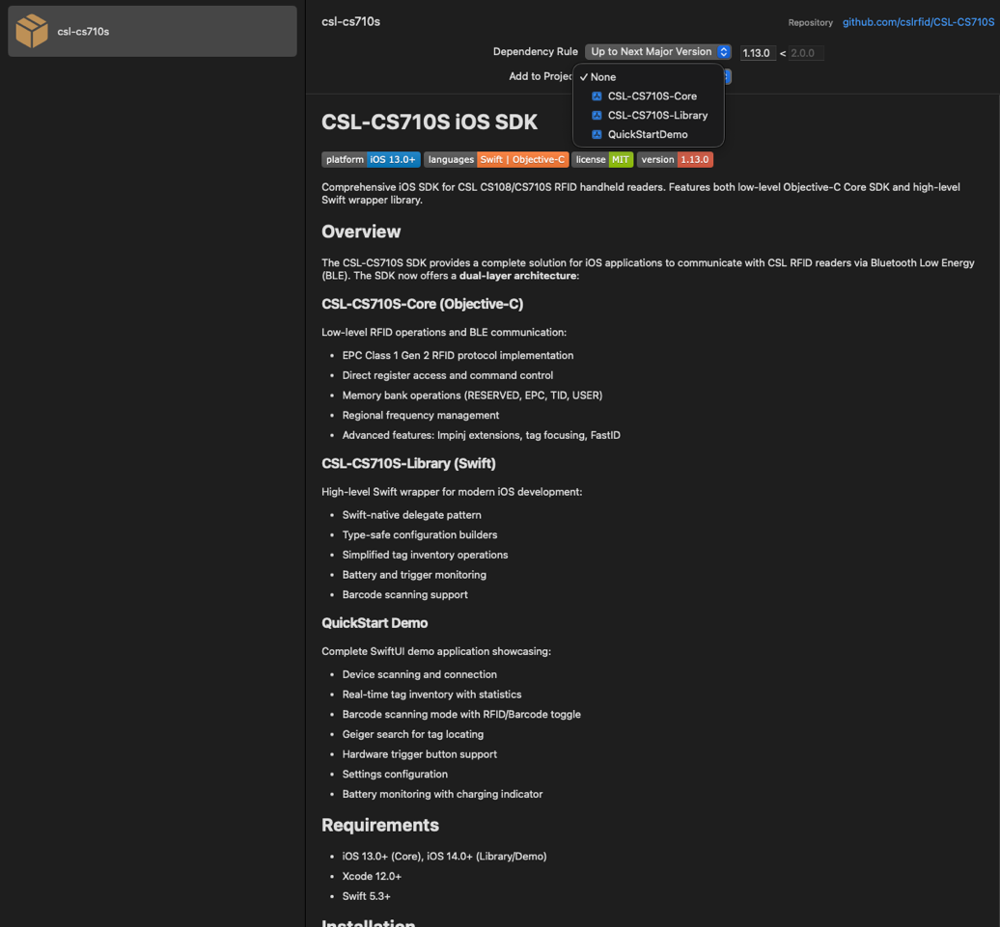
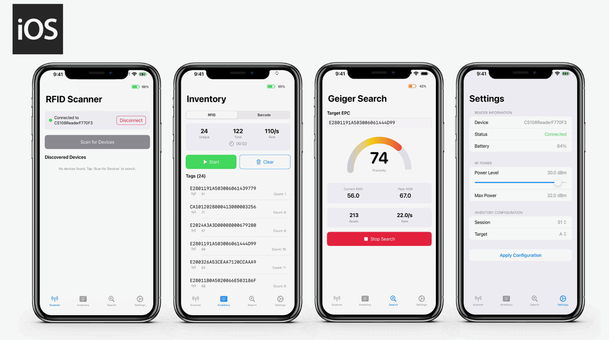

# CSL-CS710S iOS SDK


Comprehensive iOS SDK for CSL CS108/CS710S RFID handheld readers. Features both low-level Objective-C Core SDK and high-level Swift wrapper library.

## Overview

The CSL-CS710S SDK provides a complete solution for iOS applications to communicate with CSL RFID readers via Bluetooth Low Energy (BLE). The SDK now offers a **dual-layer architecture**:

### CSL-CS710S-Core (Objective-C)
Low-level RFID operations and BLE communication:
- EPC Class 1 Gen 2 RFID protocol implementation
- Direct register access and command control
- Memory bank operations (RESERVED, EPC, TID, USER)
- Regional frequency management
- Advanced features: Impinj extensions, tag focusing, FastID

### CSL-CS710S-Library (Swift)
High-level Swift wrapper for modern iOS development:
- Swift-native delegate pattern
- Type-safe configuration builders
- Simplified tag inventory operations
- Battery and trigger monitoring
- Barcode scanning support

### QuickStart Demo
Complete SwiftUI demo application showcasing:
- Device scanning and connection
- Real-time tag inventory with statistics
- Barcode scanning mode with RFID/Barcode toggle
- Geiger search for tag locating
- Hardware trigger button support
- Settings configuration
- Battery monitoring with charging indicator

## Requirements

- iOS 13.0+ (Core), iOS 14.0+ (Library/Demo)
- Xcode 12.0+
- Swift 5.3+

## Installation

### Swift Package Manager (Recommended)



**Xcode 13+:**

1. Go to `File` > `Add Packages...`
2. Enter: `https://github.com/cslrfid/CSL-CS710S.git`
3. Select version `1.13.0` or later
4. Choose product(s):
   - `CSL-CS710S-Core` - Low-level Objective-C SDK only
   - `CSL-CS710S-Library` - High-level Swift wrapper (includes Core)

**Package.swift:**

```swift
dependencies: [
    .package(url: "https://github.com/cslrfid/CSL-CS710S.git", from: "1.13.0")
],
targets: [
    .target(
        name: "YourApp",
        dependencies: [
            .product(name: "CSL-CS710S-Library", package: "CSL-CS710S")
        ]
    )
]
```

### CocoaPods (Supported until December 2026)

> **Note**: CocoaPods will become read-only in December 2026. We recommend Swift Package Manager for new projects.

```ruby
pod 'CSL-CS710S'  # Installs Core SDK only
```

```bash
pod install
```

## Quick Start - Swift Library

### 1. Import and Initialize

```swift
import CSL_CS710S_Library

class ViewController: UIViewController {
    let rfidManager = RfidManager.shared
}
```

### 2. Scan for Readers

```swift
extension ViewController: RfidScanDelegate {
    func startScanning() {
        rfidManager.startScan(delegate: self)
    }

    func onReaderDiscovered(_ reader: RfidReader) {
        print("Found: \(reader.name) RSSI: \(reader.rssi)")
    }

    func onScanError(_ error: RfidError) {
        print("Error: \(error.description)")
    }
}
```

### 3. Connect to Reader

```swift
extension ViewController: RfidConnectionDelegate {
    func connectToReader(_ reader: RfidReader) {
        rfidManager.connect(to: reader, delegate: self)
    }

    func onReaderReady(_ reader: RfidReader) {
        print("Connected to \(reader.name)")
        configureReader()
    }

    func onDisconnected(_ reader: RfidReader, reason: String) {
        print("Disconnected: \(reason)")
    }
}
```

### 4. Configure Reader

```swift
extension ViewController: RfidConfigurationDelegate {
    func configureReader() {
        rfidManager.configure()
            .powerLevel(300)  // 30.0 dBm
            .session(1)       // Session S1
            .target(0)        // Target A
            .apply(delegate: self)
    }

    func onConfigured(_ config: RfidConfiguration) {
        print("Power: \(config.powerLevel), Session: \(config.session)")
    }
}
```

### 5. Start Tag Inventory

```swift
extension ViewController: RfidInventoryDelegate {
    func startInventory() {
        rfidManager.startInventory(delegate: self)
    }

    func onTagRead(_ tag: RfidTag) {
        print("EPC: \(tag.epc), RSSI: \(tag.rssi), Count: \(tag.count)")
    }

    func onInventoryRound(_ stats: RfidInventoryStats) {
        print("Unique: \(stats.uniqueCount), Rate: \(stats.readRate)/s")
    }

    func stopInventory() {
        rfidManager.stopInventory()
    }
}
```

### 6. Monitor Battery

```swift
extension ViewController: BatteryDelegate {
    func startBatteryMonitoring() {
        rfidManager.startBatteryMonitoring(delegate: self)
    }

    func onBatteryUpdate(_ info: BatteryInfo) {
        print("Battery: \(info.level)% Charging: \(info.isCharging)")
    }
}
```

### 7. Geiger Search (Tag Locating)

```swift
extension ViewController: RfidGeigerDelegate {
    func startTagSearch(epc: String) {
        rfidManager.startGeigerSearch(targetEpc: epc, delegate: self)
    }

    func onSearchStarted() {
        print("Geiger search started")
    }

    func onProximityUpdate(_ stats: RfidGeigerStats) {
        print("RSSI: \(stats.currentRssi), Peak: \(stats.peakRssi)")
        print("Proximity: \(stats.proximity)%, Count: \(stats.readCount)")
    }

    func onSearchStopped(_ reason: RfidStopReason) {
        print("Search stopped: \(reason)")
    }

    func stopTagSearch() {
        rfidManager.stopGeigerSearch()
    }
}
```

### 8. Barcode Scanning

```swift
extension ViewController: BarcodeScanDelegate {
    func startBarcodeScanning() {
        rfidManager.startBarcodeScan(delegate: self)
    }

    func onBarcodeScanned(_ data: BarcodeData) {
        print("Barcode: \(data.barcode)")
        print("Timestamp: \(data.timestamp)")
    }

    func onStatisticsUpdate(_ stats: BarcodeStats) {
        print("Total: \(stats.totalScans), Unique: \(stats.uniqueBarcodes)")
    }

    func stopBarcodeScanning() {
        rfidManager.stopBarcodeScan()
    }
}
```

### 9. Hardware Trigger Support

```swift
extension ViewController: TriggerDelegate {
    func enableTrigger() {
        rfidManager.enableTrigger(delegate: self)
    }

    func onTriggerStateChanged(_ pressed: Bool) {
        if pressed {
            startInventory()  // Trigger pressed
        } else {
            stopInventory()   // Trigger released
        }
    }
}
```

## Quick Start - Objective-C Core SDK



### 1. Initialize

```objective-c
#import <CSL_CS710S_Core/CSL_CS710S_Core.h>

CSLRfidAppEngine *appEngine = [CSLRfidAppEngine sharedAppEngine];
CSLBleReader *reader = appEngine.reader;
```

### 2. Scan and Connect

```objective-c
reader.delegate = self;
reader.scanDelegate = self;

[reader startScanDevice];
// In delegate callback:
[reader connectDevice:peripheral];
```

### 3. Configure Settings

```objective-c
appEngine.settings.power = 30;
appEngine.settings.session = S1;
appEngine.settings.target = ToggleAB;

[CSLReaderConfigurations setConfigurationsForTags];
```

### 4. Start Inventory

```objective-c
[reader startInventory];

- (void)didReceiveTagResponsePacket:(CSLBleTag *)tag {
    NSLog(@"EPC: %@, RSSI: %d", tag.EPC, tag.rssi);
}

[reader stopInventory];
```

## Project Structure

```
CSL-CS710S/
├── Package.swift                    # SPM package definition (dual products)
├── CSL-CS710S.podspec              # CocoaPods specification
├── CSL-CS710S.xcworkspace          # Xcode workspace
├── CSL-CS710S-Core/                # Low-level Objective-C SDK
│   ├── include/                    # Public headers
│   ├── CSLReader/                  # BLE & RFID implementation
│   └── CSLModel/                   # Business logic layer
├── CSL-CS710S-Library/             # High-level Swift wrapper
│   └── Sources/
│       ├── RfidManager.swift       # Main API entry point
│       ├── CoreBridge.swift        # Obj-C bridge
│       ├── Models/                 # Data models (RfidTag, BarcodeData, etc.)
│       ├── Protocols/              # Delegate protocols
│       └── Config/                 # Configuration enums
└── QuickStartDemo/                 # SwiftUI demo app
    ├── README.md
    └── QuickStartDemo/
        ├── QuickStartDemoApp.swift # App entry point
        ├── ContentView.swift       # Tab-based navigation
        ├── Info.plist              # App configuration (BLE permissions, light mode)
        ├── Assets.xcassets/        # App icons and launch images
        ├── LaunchScreen.storyboard # Launch screen with CSL logo
        ├── Views/
        │   ├── ScannerView.swift   # Device discovery
        │   ├── InventoryView.swift # Tag/Barcode scanning
        │   ├── SettingsView.swift  # Reader configuration
        │   └── GeigerSearchView.swift # Tag locating
        └── ViewModels/
            └── RfidViewModel.swift # MVVM view model
```

## Architecture

### CSL-CS710S-Core Modules

**CSLReader/** - Communication Layer
- `CSLBleInterface`: CoreBluetooth manager
- `CSLBleReader`: RFID command/response protocol
- `CSLBleReader+AccessControl`: Tag memory operations
- `CSLBlePacket`: Packet encoding/decoding
- `CSLBleTag`: Tag data model

**CSLModel/** - Business Logic
- `CSLRfidAppEngine`: Singleton lifecycle manager
- `CSLReaderSettings`: Configuration persistence
- `CSLReaderFrequency`: Regional frequency tables
- `CSLReaderConfigurations`: Setup utilities

### CSL-CS710S-Library Architecture

- **RfidManager**: Singleton entry point for all operations
- **CoreBridge**: Swift-to-Objective-C bridging layer
- **Delegate Protocols**: Type-safe callback interfaces
  - `RfidScanDelegate`: Device discovery events
  - `RfidConnectionDelegate`: Connection lifecycle
  - `RfidInventoryDelegate`: Tag reading events
  - `RfidGeigerDelegate`: Proximity/locate operations
  - `BarcodeScanDelegate`: Barcode scanning events
  - `BatteryDelegate`: Battery monitoring
  - `TriggerDelegate`: Hardware trigger events
- **Configuration Builder**: Fluent API for reader setup
- **Data Models**: `RfidTag`, `BarcodeData`, `RfidGeigerStats`, `BatteryInfo`

### Supported Reader Models

- **CS710S**: Full E710 register support (30+ link profiles)
- **CS108**: Legacy command protocol support

### Regional Frequency Support

Automatic frequency configuration for:
- FCC (United States)
- ETSI (Europe)
- JP (Japan)
- TW (Taiwan)
- CN (China)
- MY (Malaysia)
- And more...

## QuickStart Demo

The demo app demonstrates complete RFID workflows:

```bash
cd QuickStartDemo
open ../CSL-CS710S.xcworkspace
# Build and run QuickStartDemo scheme
```

Features:
- **Scanner Tab**: BLE device discovery and one-tap connection with connection overlay
- **Inventory Tab**: Real-time tag scanning with RFID/Barcode mode toggle
  - Segmented picker to switch between RFID and Barcode modes
  - Live statistics (unique count, total reads, read rate)
  - Elapsed time tracking
  - Tap on tag to navigate to Geiger Search
- **Settings Tab**: Power level (0-32 dBm), session (S0-S3), target (A/B) configuration
  - Audio beep and haptic feedback toggles
- **Geiger Search Tab**: Locate specific tags using RSSI proximity
  - Semi-circular proximity gauge with visual indicator
  - Current RSSI and peak RSSI display
  - Read count and read rate monitoring
  - Hardware trigger support for start/stop
- **Hardware Trigger**: Physical trigger button support for all operations
- **Battery Monitoring**: Real-time battery level with charging indicator
- **CSL Branding**: Custom app icon and launch screen with CSL logo
- **Light Mode**: Enforced light appearance for consistent UI

See [QuickStartDemo/README.md](QuickStartDemo/README.md) for setup instructions.

## Thread Safety

- Core SDK: Operations are synchronous with timeout mechanisms
- Swift Library: All delegate callbacks on main thread
- Critical sections protected with `@synchronized` blocks
- **Important**: Wait for command completion before issuing next command

## Version History

### 1.13.0 (Current)
- **Added CSL-CS710S-Library** - High-level Swift wrapper
- **Added QuickStart Demo** - SwiftUI sample application
- **Geiger Search** - Tag locating with RSSI proximity gauge
- **Barcode Scanning** - RFID/Barcode mode toggle with timestamp tracking
- **Hardware Trigger** - Physical trigger button support for all operations
- **Enhanced UI** - CSL branding (app icons, launch screen), light mode enforcement
- **Dual-layer architecture** - Core (Obj-C) + Library (Swift)
- **Swift Package Manager** - Dual product support
- Reorganized project structure for better maintainability
- Enhanced type safety with Swift protocols and models

### 1.12.0
- **Added Swift Package Manager support** - Future-proof distribution method
- Dual distribution support - Works with both CocoaPods and Swift Package Manager
- Reorganized header structure - All public headers now in `include/` directory
- Fixed enum naming conflict (ALERTCONDITION) for better system compatibility
- Updated framework imports to use module syntax
- **Updated .gitignore** - Added Swift Package Manager build artifacts exclusion

### 1.11.0
- Removed MQTTClient dependency
- Streamlined codebase for pure RFID operations

### 1.10.0
- Bug fix on `getRfidFwVersionNumber`
- Improved firmware version detection

### 1.9.0
- Added link profile support for CS710S firmware 2.1.2+
- Extended to 30+ link profile options

## Migration Guide

### From 1.11.x to 1.12.0+

**Swift Projects (New)**:
```swift
// Old: Direct Objective-C usage
let reader = CSLRfidAppEngine.shared().reader

// New: Swift Library wrapper
let manager = RfidManager.shared
manager.startInventory(delegate: self)
```

**Objective-C Projects**:
```objective-c
// No changes required - Core SDK remains compatible
// Import path changed to CSL_CS710S_Core
#import <CSL_CS710S_Core/CSL_CS710S_Core.h>
```

## Building from Source

```bash
git clone https://github.com/cslrfid/CSL-CS710S.git
cd CSL-CS710S

# Swift Package Manager
swift build

# Validate CocoaPods spec
pod spec lint CSL-CS710S.podspec

# Xcode workspace
open CSL-CS710S.xcworkspace
```

## Troubleshooting

### Connection Issues
- Ensure Bluetooth is enabled and permissions granted
- Check reader is powered on and within range
- Verify iOS device supports BLE

### Inventory Performance
- Adjust power level (lower in dense environments)
- Select appropriate session (S1 recommended)
- Enable tag focusing for faster singulation

### Swift Library Issues
- Ensure both Core and Library products are linked
- Verify delegate conformance
- Check main thread for UI updates

### Geiger Search
- Ensure target EPC is valid hexadecimal string
- RSSI resets to 0 after 2 seconds without tag reads
- Adjust power level if tag is too far away

### Barcode Scanning
- Barcode module must be present on reader hardware
- Scanner stops when trigger is released
- Duplicate barcodes are filtered automatically

## License

MIT License - see [LICENSE](LICENSE) file.

## Manufacturer

**Convergence Systems Limited**
Leading provider of RFID solutions and hardware

---

**Note**: This SDK is for professional RFID applications. Ensure compliance with local RF regulations.
